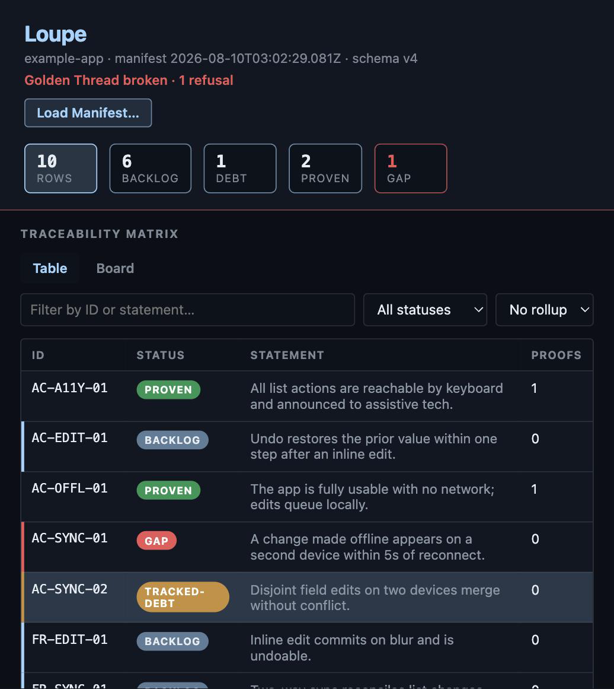
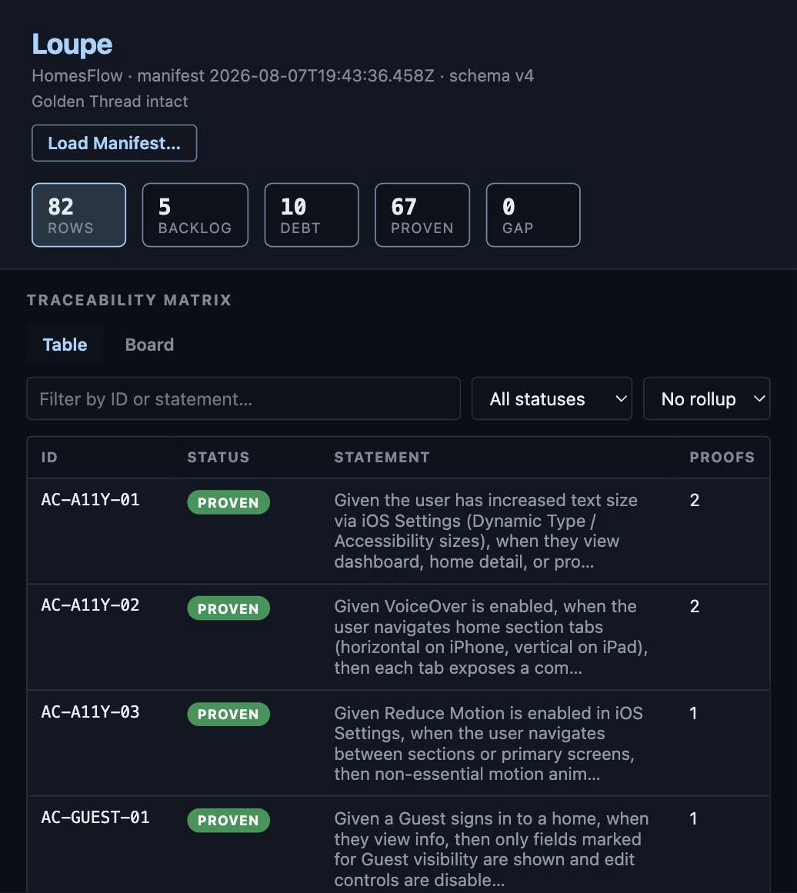

# SpecAssay

Every honest piece of work stands on three legs: the **intent** (why we're doing it), the **build** (the code that does it), and the **proof** (a test that answers for it). Kick out any leg and it topples. SpecAssay is the assay office for that work. It tests that all three legs are present and tied together, refuses to pass work as "done" when a leg is quietly missing, and strikes what it finds into a small file, the *trace-manifest*, so anyone can read the provenance long after everyone's gone home.

Assay offices have tested gold and struck it with a hallmark for seven hundred years, so provenance can be read at a glance. The office has a word for the failure SpecAssay exists to catch: **gilt**, base metal dressed to gleam like the real thing. AI makes gilt cheap. Assaying is the answer.

**For a developer:** it's a [GitHub Spec Kit](https://github.com/github/spec-kit) bundle. It adds durable IDs to your templates, runs a deterministic Gate on every push, and emits a `trace-manifest.json` ([sample](./samples/homesflow.trace-manifest.json)) in your repo, readable raw or in [Loupe](https://loupe.dryfoos.com/). No fork, no daemon, no second system to keep in sync: the thread lives in the repo.

[`PROMOTION-CONTRACT.md`](./PROMOTION-CONTRACT.md) defines the rules of promotion: what counts as covered, what counts as debt, what gets refused. The contract is the spec; SpecAssay carries it into your templates and enforces it at the Gate.

## The three legs

- **Intent**: the why, minted once as a durable ID (`US-…`, `FR-…`, `NFR-…`, `AC-…`) in the registry (usually the PRD). Minted at intent, never inferred from code later, never renumbered.
- **Build**: the code that serves an intent leaves a one-line `@covers ID` mark where it lives. Greppable, author-written.
- **Proof**: the test that answers for an acceptance criterion encodes the AC's ID in its name (`test_AC_HOME_15_…`).

The **Golden Thread** is the line that ties the three together, intent to build to proof. When every leg is present and linked, the thread holds. When an acceptance criterion has neither a proof nor an openly-admitted debt, the thread frays. That's a silent gap, and the Gate refuses it.

## How it works (a day in the thread)

1. **Intend.** The business settles a story; you mint its IDs into the registry. Not building it yet? Mint the ID *and* write one open `Carries:` TODO. That's **anointed backlog**: an honest "coming soon," not a broken thread.
2. **Build.** You (or your AI, using the Spec Kit workflow) implement it, leaving `@covers ID` on the source that carries each intent and `**Carries**:` on each task.
3. **Prove.** You write the test named to the acceptance criterion it answers for.
4. **Gate.** `speckit.specassay-check.gate` (Gate 2) scans registry, specs, tasks, `@covers`, and named tests, and refuses on silent AC gaps, untraced scope, or registry↔spec↔tasks drift. It writes the trace-manifest **even when it fails**, so the break is visible, not hidden.
5. **Read.** [Loupe](https://loupe.dryfoos.com/) reads that trace-manifest and shows each intent walked top to bottom: proven (green), honest debt (amber), waiting (blue), or a frayed gap (red).

**CI is the property line.** A Gate on a compliant laptop is a courtesy; a cowboy (or a cold agent) with no local install can still push unmarked work. Run Gate 2 in CI on every PR and every commit to a protected branch, and fail the build when the thread breaks. Local Gate is optional hygiene; the CI Gate is what protects the thread. The emitted `trace-manifest.json` is the refusal's evidence trail.

## The honest states

Passing does not mean "everything is done." It means nothing *unfinished* is *hidden* at acceptance-criterion altitude. The states are named so debt can stay visible instead of hiding behind a false green:

| State            | Meaning                                                      |
| ---------------- | ------------------------------------------------------------ |
| **proven**       | A named carrier exists (an AC test, or `@covers`/proof for US/FR/NFR). A fact that a carrier exists, not a claim the code is correct. |
| **tracked-debt** | Started, proof missing, but admitted on an open task with `Carries:`. Visible, on the books. |
| **backlog**      | A US/FR/NFR with no carrier yet, or an ID anointed into backlog (registry entry + open `Carries:` TODO). Planning altitude, not a silent gap. |
| **GAP**          | A silent AC gap: neither proof nor open debt. The Golden Thread is broken; the Gate refuses. |
| **retired**      | Withdrawn on purpose, not violated: an ID named in an explicit, dated `**Retires**:` record on an open task. Never a settable field — the record is the only way in. |

Silent-gap refusal is **AC-only** (acceptance criteria are the atomic unit of "covered"); US/FR/NFR without a carrier are `backlog`, not `GAP`.

`retired` is `trace-manifest.v5beta.json`-only: `trace-manifest.json` (v4) freezes at exactly the first four values, and a retired row instead leaves `rows[]` for a top-level `retired: [{id, date, reason}]` list, so nothing disappears silently from either document — see [`docs/trace-manifest-schema.md`](docs/trace-manifest-schema.md).

## Uncovered proof: report-only is the shipped default; blocking is earned

`orphan-covers` catches an `@covers` mark naming an ID that isn't real. Its mirror, `uncovered-proof`, catches the reverse: a real, tested, `proven` ID that no file's `@covers` mark ever claims — self-documentation nobody wrote, invisible until you cross-reference by hand.

**`uncovered-proof` ships as a diagnostic.** It never fails the Gate on its own — you'll see it in `gate.diagnostics[]`, `gate.ok` untouched, for any ID this applies to. Real projects carry a real backlog of these the first time this check runs on them; report-only is what lets you see the size of that backlog before anything blocks on it.

**`block_uncovered_proof` is a per-project ratchet, not a switch.** Clear your own backlog to zero, *then* flip it on in your `specassay-check-config.yml` — never as a global flag day across every project you maintain, and never reversed once flipped. The flip itself should carry a dated comment on that line, so *when* and *why* your project's enforcement status changed stays traceable, the same as any other decision this tool asks you to leave a record of.

## The trace-manifest (`trace-manifest.json`)

Gate 2 always writes a portable, vendor-neutral **[trace-manifest](./samples/homesflow.trace-manifest.json)** (default path `trace-manifest.json`, configurable as `manifest_path`):

- `format: "trace-manifest"`, `schemaVersion: 4`, `emitter: "specassay-check"`
- Rows: id, statement, status (`proven` | `tracked-debt` | `GAP` | `backlog`), implementations, proofs
- Top-level `gate: { ok, failures[] }` so non-row refusals (orphans, drift, missing `Carries:`) are visible to viewers
- Written even when the Gate fails, so silent AC gaps are visible in the file
- **Exact-set** registry ≡ specs ≡ tasks (no unclaimed registry IDs), except **anointed backlog**

The `format` value is deliberately vendor-neutral: `trace-manifest` belongs to no single tool, so any emitter can write one and any viewer can read it. Not ReqIF/OSLC; see [`docs/trace-manifest-schema.md`](./docs/trace-manifest-schema.md).

**Reading a trace-manifest in SDLC terms** (intent → build → proof → Gate → Loupe): [`docs/reading-a-manifest.md`](./docs/reading-a-manifest.md). Visual tour with screenshots: [**specassay.com/field-guide**](https://specassay.com/field-guide). **Does it work cold?** A zero-context agent on stock Spec Kit + this bundle delivered a PRD item end to end, Gate-clean: [`docs/testing/completed/evidence-cold-agent-trial.md`](./docs/testing/completed/evidence-cold-agent-trial.md). **Want to test it on real work?** The runbook, setup through tear-out: [`docs/testing/4-real-work-test.md`](./docs/testing/4-real-work-test.md). **Something looks wrong?** [`docs/troubleshooting.md`](./docs/troubleshooting.md) — every entry taught by a real incident, not a guess.

## What you get

| Component | Id                | Role                                                         |
| --------- | ----------------- | ------------------------------------------------------------ |
| Preset    | `specassay`       | Appends durable-ID / `Carries:` grammar onto Spec Kit's `spec-template`, `tasks-template`, and `constitution-template` |
| Extension | `specassay-check` | Gate 2 check + **trace-manifest emitter** (`speckit.specassay-check.gate`) |

Bundle id: `specassay`.

## Install (catalog path)

<!-- @covers FR-DOCS-10 -->


From a Spec Kit project (`specify init` already done):

```bash
specify preset catalog add \
  https://raw.githubusercontent.com/rdryfoos/specassay/main/catalogs/presets.json \
  --name specassay --install-allowed

specify extension catalog add \
  https://raw.githubusercontent.com/rdryfoos/specassay/main/catalogs/extensions.json \
  --name specassay --install-allowed

specify bundle catalog add \
  https://raw.githubusercontent.com/rdryfoos/specassay/main/catalogs/bundles.json \
  --id specassay --policy install-allowed

specify bundle install specassay
```

If Gate config wasn't scaffolded automatically, copy it once and point it at your repo:

```bash
cp .specify/extensions/specassay-check/config-template.yml \
   .specify/extensions/specassay-check/specassay-check-config.yml
# then edit registry / globs in specassay-check-config.yml
```

Run Gate 2 locally (fast feedback):

```bash
bash .specify/extensions/specassay-check/scripts/check-traceability.sh
# writes trace-manifest.json; or via the agent command: /speckit.specassay-check.gate
```

**See a real refusal, before you have anything of your own to break.** A
fresh install has nothing minted yet, so there's nothing local to break on
purpose — trust the bundled example instead. This is a real Gate 2 emit,
not a hand-written sample: `examples/example-app` in this repo, with one
proof (`AC-SYNC-01`'s test) renamed so it stops matching:

```text
FAIL: silent gap: AC-SYNC-01 has no test and no open tracked-debt task
Wrote trace-manifest.v5beta.json (10 rows, schemaVersion 5, beta)
Wrote trace-manifest.json (10 rows) gate.ok=False
SpecAssay Check (Gate 2): FAILED
```

`trace-manifest.json` still gets written — the refusal is recorded, not
hidden. Loaded into [Loupe](https://loupe.dryfoos.com/app/), the same break
looks like this: the thread frays exactly at `AC-SYNC-01`, everything else
unaffected. (Load [`samples/sample-gap.trace-manifest.json`](samples/sample-gap.trace-manifest.json)
yourself via Loupe's **Load Manifest…** button to see it live.)


*`example-app · manifest 2026-08-10T03:02:29.081Z` (visible in Loupe's
header) — `samples/sample-gap.trace-manifest.json`, loaded live at
loupe.dryfoos.com/app on 2026-08-18.*

Once you've minted your own first ID and it's carried by real spec/task/code,
the same move — remove or rename its proof, rerun the Gate — is how you
verify the refusal actually works on *your* thread, not just the sample.
Passing doesn't mean nothing's wrong; it means nothing's *hidden*.

*This quickstart is `FR-DOCS-10` in this repo's own registry — see [`PRD.md`](./PRD.md).*

**Dev path:**

```bash
specify preset add --dev /path/to/specassay/presets/specassay
specify extension add --dev /path/to/specassay/extensions/specassay-check
```

**Already running an older install?** [`docs/migration.md`](./docs/migration.md) — three real upgrade frictions, each tested against the real CLI, with the workaround that actually worked for each.

## Samples

| File                                                         | Role                                                         |
| ------------------------------------------------------------ | ------------------------------------------------------------ |
| [`samples/homesflow.trace-manifest.json`](./samples/homesflow.trace-manifest.json) | Real Gate 2 emit against HomesFlow (82 rows, 0 GAP); **Loupe's preview default**, served at loupe.dryfoos.com |
| [`samples/sample.trace-manifest.json`](./samples/sample.trace-manifest.json) | Clean synthetic `example-app` demo (`gate.ok`, 0 GAP); the shareable "shape" artifact and dev fallback |
| [`samples/sample-gap.trace-manifest.json`](./samples/sample-gap.trace-manifest.json) | The `example-app` demo with one AC gilted into a silent **GAP** (`gate.ok: false`); shows the refusal / broken-thread state |

Samples can be viewed in [Loupe](https://loupe.dryfoos.com/app) by uploading a local copy via Loupe's `Load Manifest...` button.

*Screenshots in this README are real, self-dating captures of the actual
tool on real data (family standard, 2026-08-19), never mockups — the
manifest timestamp visible in each one is the proof. When Loupe's UI or
the underlying sample changes enough to make a capture stale, recapturing
it is part of that change.*


*`HomesFlow · manifest 2026-08-07T19:43:36.458Z` (visible in Loupe's
header) — Loupe's own default preview at loupe.dryfoos.com/app, captured
2026-08-18.*

See [`samples/README.md`](./samples/README.md). 

## What SpecAssay is not

- **Not a fork of Spec Kit**, and not a replacement: a bundle that overlays the stock workflow.
- **Not Thorsten Schlathölter's [`clew`](https://ariadne-thread.io)** (an inner-loop, code-anchored constructor). SpecAssay is complementary altitude (promotion and refusal on the outer loop) and cites `clew` as prior art.
- **Not a visualizer.** [Loupe](https://loupe.dryfoos.com/) (or any viewer) may read `trace-manifest.json`; viewers never mint IDs or re-scan the target.
- **Not agent kanban / human-approval lanes**, and not HomesFlow-specific paths (those stay in HomesFlow as a worked example).

## License

MIT. See [`LICENSE`](./LICENSE).
