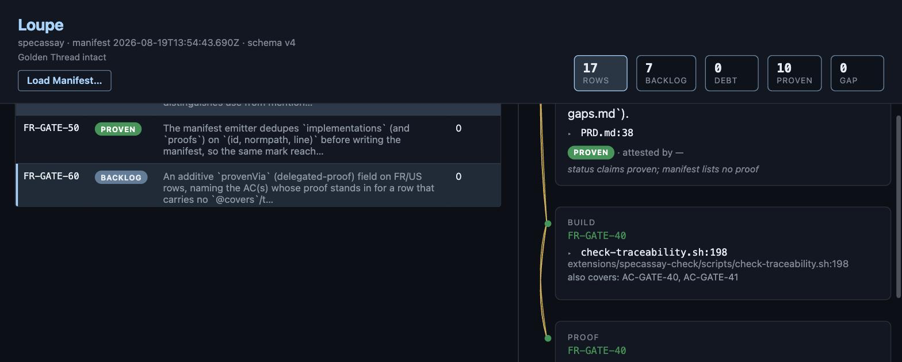
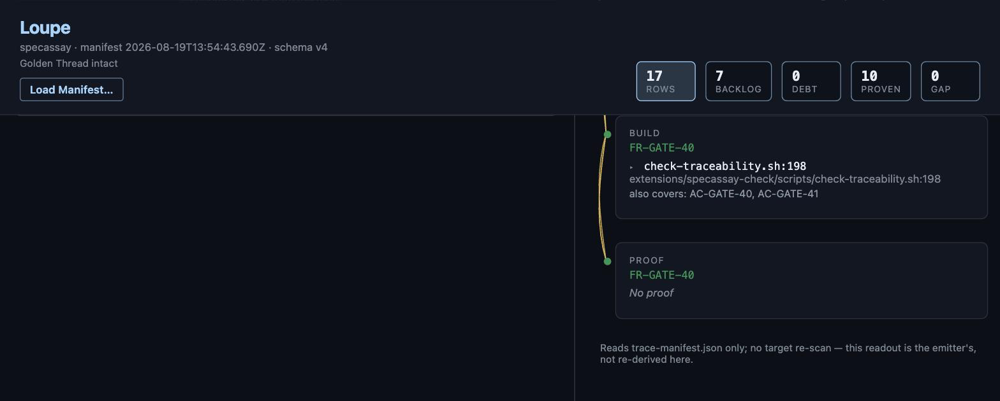

# Troubleshooting

<!-- @covers FR-DOCS-30, FR-DOCS-40 -->

Every entry here is taught by a real incident — a bug that actually
shipped, a finding from a real trial, or something the docs room hit
founding this repo's own registry. None of this is hypothetical. Each entry
cites what taught it, the same discipline `@covers` asks of source code
(FR-DOCS-30, [`PRD.md`](../PRD.md)).

**Maintenance note:** entries with screenshots carry a real, self-dating
capture of the actual tool on real data, never a mockup (family standard,
2026-08-19). A stale screenshot is a false claim — when a change materially
alters a pictured surface, recapturing it is part of that change, not a
follow-up. Dated filenames (`<slug>-YYYYMMDD.png`) make staleness visible.

## The Gate refuses right after you close a `backlog` task

**You'll see:** `FAIL: registry ID missing from specs: FR-XXX-NN`, or the ID
flips from `backlog` to `GAP`, immediately after you tick a checkbox on the
task that was carrying it as anointed backlog.

**What's happening:** anointed backlog (Rule 5a) excuses a registry ID from
the exact-set rule *only* while its `Carries:` TODO stays open. Closing
that task removes the excuse. If nothing else claims the ID — no `@covers`,
no spec entry, no still-open task — the Gate has nothing left to call it
except drift or a silent gap.

**Fix:** don't close the task until the ID has a real carrier. If the work
genuinely shipped, give it one before closing: a spec entry
(`specs/<feature>/spec.md`) for a normal feature, or a real `@covers` mark
if the "build" is a source or config change. If the work was deliberately
*withdrawn*, not shipped, this repo doesn't have a clean answer for that
yet — see `FR-GATE-30` below.

**Taught by:** two independent incidents, same root cause. HomesFlow's
first intent retirement hit this closing a task on purpose for withdrawn
work (`docs/backlog.md`, "Pattern candidate: retired as a first-class
terminal state"). This repo hit the honest version of it closing `T910`
(`FR-DOCS-50`) after the config change had actually shipped — the fix there
was adding `specs/self-gate-config/spec.md` as a real spec claim, not
reopening the task.

## `orphan-covers` fires on a docs file quoting an `@covers` line

**You'll see:** `FAIL: untraced scope (@covers): AC-XXX-NN not in registry`,
pointing at a line in a doc or a comment that was clearly quoting an
example, not declaring a real mark.

**What's happening (pre-`FR-GATE-40`):** `orphan-covers` used to scan every
file in `src_globs` for anything shaped like `@covers ID`, with no way to
tell a real claim from a citation — another project's real ID mentioned as
an example, or this project's own ID quoted inside a fenced code block or
inline backtick span.

**Fix:** upgrade. `FR-GATE-40` (2026-08-18) fixed this two ways: IDs whose
domain was never minted into this registry are treated as citations, not
claims (the same `is_local_domain()` scoping `orphan-spec`/`orphan-task`
already had); and anything inside a markdown fenced block or inline
backtick span is ignored regardless of domain, so your own docs can safely
quote your own real IDs as teaching examples.

**Taught by:** founding this repo's own registry with `docs/**` in
`src_globs` failed immediately on `docs/testing/*.md` quoting other
projects' real `@covers` lines (`docs/docs-gaps.md`, resolved entry 2).

## Two files get written every Gate run

**You'll see:** `Wrote trace-manifest.v5beta.json (N rows, schemaVersion 5,
beta)` printed right before the familiar `Wrote trace-manifest.json`. If
you've never seen it before, it looks like something broke.

**What's happening:** nothing broke. Since v0.4.5, every Gate run writes a
second, additive file alongside the primary v4 manifest — an early, beta
look at schema v5 (opens the format to a second emitter, `clew`). v4 stays
primary and unchanged.

**Fix:** ignore it, unless you have a specific reason not to. Full spec:
[`trace-manifest-v5.md`](trace-manifest-v5.md).

**Taught by:** `docs/trace-manifest-schema.md` — the "authoritative"
reference for the primary file — never mentioned the second one existed
(`FR-DOCS-20`, `docs/docs-gaps.md`).

## The same implementation or proof is listed twice for one ID

**You'll see:** `implementations` (or `proofs`) in the manifest carrying two
entries for what's really one mark — often the same path under two
spellings, like `ios/Foo.swift` and `./ios/Foo.swift`.

**What's happening (pre-`FR-GATE-50`):** overlapping `src_globs` (or
`test_globs`) entries that both reach the same file hand it to the internal
glob expander twice, under two different literal path strings. Nothing
deduped before appending.

**Fix:** upgrade. `FR-GATE-50` (2026-08-18) dedupes on
`(id, normpath(path), line)` before writing the manifest.

**Taught by:** a real emit that carried this in 62 of 100 rows,
found while founding this repo's own registry (`docs/docs-gaps.md`,
resolved entry 3).

## `uncovered-proof` diagnostics appear after upgrading, with no `gate.ok` change

**You'll see:** new entries in `gate.diagnostics[]` —
`"uncovered proof: AC-XXX-NN has a passing test but no file's @covers line
names it"` — that weren't there before, but `gate.ok` is unaffected.

**What's happening:** this isn't new drift; it's a real, pre-existing gap
in self-documentation the Gate only started checking for in v0.4.7. A test
can genuinely prove an AC (`proven` doesn't require `@covers`, per Rule 6)
while no file's `@covers` line ever claims it — invisible until this check
existed. It ships report-only on purpose: the finding needed to be
measured across real projects before anyone could responsibly decide
whether it should block.

**Fix:** add the missing `@covers` line(s); the diagnostic clears. To make
it block instead of just report, set `block_uncovered_proof: true` — but
only once your own backlog of these is actually clear (PROMOTION-CONTRACT.md
Rule 4a).

**Taught by:** dogfooding SpecCost surfaced the first instance
(`bind.py`'s `@covers` line missing `AC-BIND-10/20/30` since its first
commit); a report-only survey across real projects at the time this shipped
found dozens more spread across multiple projects, including two in this
repo's own bundled `example-app` (CHANGELOG.md, v0.4.7).

Real output, captured 2026-08-19T13:54:30Z against a scratch fixture (an AC
proven by a real passing test, no `@covers` anywhere naming it):

```text
DIAGNOSTIC: uncovered proof: AC-FIX-01 has a passing test but no file's @covers line names it
Wrote trace-manifest.v5beta.json (1 rows, schemaVersion 5, beta)
Wrote trace-manifest.json (1 rows) gate.ok=True
SpecAssay Check (Gate 2): OK (1 registry IDs)
```

```json
{
  "gate": {
    "ok": true,
    "failures": [],
    "diagnostics": [
      {
        "kind": "uncovered-proof",
        "detail": "uncovered proof: AC-FIX-01 has a passing test but no file's @covers line names it",
        "id": "AC-FIX-01"
      }
    ],
    "executionVerified": false
  },
  "generatedAt": "2026-08-19T13:54:30.657Z"
}
```

## `gate.executionVerified: false`, even though your tests pass

**You'll see:** rows read `proven`, but the manifest's `gate` object carries
`"executionVerified": false`. If you have `test_results` configured and the
JUnit file just isn't there yet (forgot to run your suite with
`--junit-xml=...` first, or the path is wrong), stderr also prints a loud
`WARN:` about it — if `test_results` isn't configured at all, there's no
warning, just the quieter `false`.

**What's happening:** `proven` has always been able to come from a test
*name* matching an AC's grammar, which only proves a carrier exists — not
that the test currently passes, isn't a stub, or isn't a skip a grep still
sees (Rule 6a). Without a *passing* test-results report behind it, that's
still all `proven` means here, and the Gate says so rather than silently
implying a stronger claim — loudly if you told it to expect one and it's
missing, quietly if you never configured one at all.

**Fix:** point `test_results` at your test runner's JUnit XML output
(`pytest --junit-xml=...`, `node:test`'s or `vitest`'s junit reporters all
work), and make sure that file actually exists by the time the Gate runs.
`proven` then requires a passing testcase, not just a matching name, and
`executionVerified` flips to `true`.

**Taught by:** the founding-sentence repair (CHANGELOG.md, v0.4.9), verified
at the time against a real, controlled fixture — a genuinely failing test
named to match a real AC showed `proven`/`gate.ok: true` under the old
name-matching path, and `GAP`/`gate.ok: false` once `test_results` was wired
in — the exact gilt this rule exists to catch.

Real output, captured 2026-08-19T13:54:18Z against a scratch fixture
(`test_results` configured, the JUnit file not yet written):

```text
WARN: test_results configured (junit-results.xml) but the file does not exist; falling back to name-matching only, executionVerified=false in the manifest
Wrote trace-manifest.v5beta.json (1 rows, schemaVersion 5, beta)
Wrote trace-manifest.json (1 rows) gate.ok=True
SpecAssay Check (Gate 2): OK (1 registry IDs)
```

```json
{
  "gate": {
    "ok": true,
    "failures": [],
    "diagnostics": [],
    "executionVerified": false
  },
  "generatedAt": "2026-08-19T13:54:18.677Z"
}
```

## The commit-msg advisory hook never fires

**You'll see:** you installed `commit-advisory.sh` as `.git/hooks/commit-msg`
(a symlink, per its own README), commit a message naming a registry ID with
no matching `@covers` mark staged, and get no warning at all.

**What's happening (pre-0.4.11):** the hook resolved its own location with
`dirname "$0"`, which resolves relative to the *symlink's* location
(`.git/hooks`), not the real script's — so it computed the wrong extension
directory, silently failed its own config lookup, and exited without ever
running the check. The standalone script (not installed as a symlink)
never showed the bug, which is exactly why it went unnoticed.

**Fix:** upgrade to 0.4.11+, which resolves the real path with
`python3 -c 'os.path.realpath(...)'` before computing the extension
directory.

**Taught by:** testing the hook as *actually installed* in a real repo, not
just running the standalone script (CHANGELOG.md, v0.4.11).

## Loupe shows a green `PROVEN` badge, but the Proof panel says "No proof"

**You'll see:** an FR or US row reads `PROVEN` in the matrix, but expand its
drawer and the Proof stage says `No proof`, and Loupe itself flags it —
*"status claims proven; manifest lists no proof"* — directly under the
badge.

**What's happening:** this isn't a bug, it's rule 6 rendered honestly.
`proven` for an FR/US only ever required `@covers` *or* a named test, never
both — so an FR carried entirely by source (`@covers`, no test of its own)
is legitimately `proven` with an empty `proofs[]`. Loupe already names the
mismatch rather than hiding it; what it can't yet do is explain *why* the
row is proven anyway when its own proof genuinely lives one level down, in
child ACs. That gap is exactly what `FR-GATE-60` (an additive `provenVia`
field, naming the AC(s) whose proof stands in) is proposed to close — see
`PRD.md`. Still `backlog`: the open design question (author-declared vs.
emitter-inferred) hasn't been ruled on yet.

**Fix:** nothing to fix today — the badge is accurate, not broken. Read the
row's `implementations[]` (its `@covers` marks) as the real evidence in the
meantime.

**Taught by:** this repo's own registry, live — `FR-GATE-40` in `PRD.md`,
loaded into Loupe the same day this entry was written.


*This repo's own real manifest, `manifest 2026-08-19T13:54:43.690Z` (visible
in Loupe's header), loaded live at loupe.dryfoos.com/app. Captured before
the `FR-GATE-60` fix ships, while this symptom can still happen.*


*Same manifest, same timestamp, scrolled down — the Build card's real
`@covers` mark above it, the Proof card's "No proof" below.*
